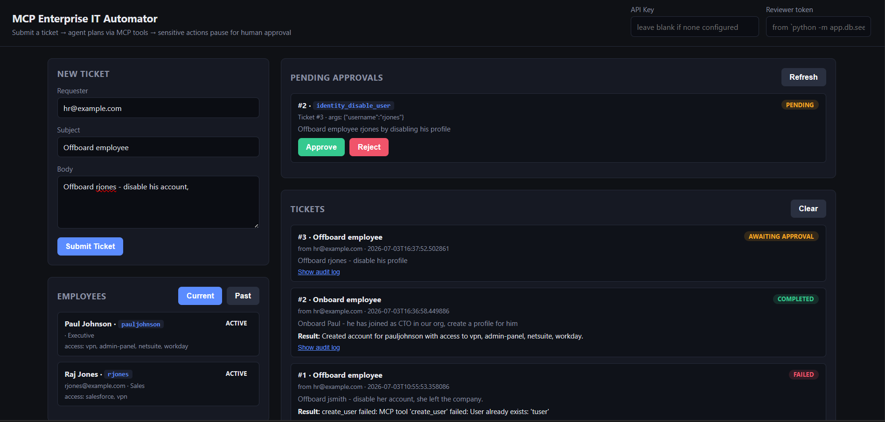

# MCP-Enabled Enterprise IT Automator

A multi-agent-style IT automation system that processes employee onboarding/offboarding
tickets by reasoning over a custom **Model Context Protocol (MCP)** server, with
**human-in-the-loop (HITL)** approval enforced server-side for sensitive actions.




## Architecture

```
                 ┌─────────────┐        JSON-RPC over stdio        ┌────────────────────┐
  HTTP ticket ─▶ │  FastAPI    │ ─▶ LangGraph agent ─▶ MCP client ─▶│  Custom MCP server  │
                 │  (api/main) │        (agent/graph)                │  (mcp_server/server)│
                 └──────┬──────┘                                     └──────────┬──────────┘
                        │                                                       │
                        ▼                                                       ▼
                 Approvals / Tickets                                   Mock enterprise identity
                 (Postgres/SQLite)                                     store + audit log (same DB)
```

- **`app/mcp_server/`** — a real MCP server (built on the official `mcp` Python SDK)
  exposing IT-provisioning tools (`get_user`, `create_user`, `grant_access`,
  `disable_user`, `revoke_access`) over JSON-RPC, on either of two transports
  (see **MCP transport: local vs. remote** below). `create_user` auto-grants
  a default access bundle based on the employee's `department`
  (`DEPARTMENT_ACCESS_DEFAULTS` in `tools.py` — e.g. Engineering gets
  `vpn`, `github:engineering`, `jira:core-platform`; IT additionally gets
  `admin-panel`; unmapped departments get `vpn` only), so onboarding tickets
  don't need to spell out every resource. Sensitive tools
  (`disable_user`, `revoke_access`) require a server-verified `approval_id` —
  the server itself refuses the call if no human has approved that *exact*
  tool + arguments combination (`approval_gate.py`). This is a real security
  boundary, not a prompt-level suggestion the LLM could talk its way past, and
  it is enforced identically regardless of which transport the client used to
  reach the server.
- **`app/agent/`** — a [LangGraph](https://langchain-ai.github.io/langgraph/) DAG:
  `plan → route → execute_step → route → ... → finalize`, with a dedicated
  `await_approval` node that uses LangGraph's `interrupt()` to pause the whole
  graph (checkpointed) whenever the next planned step is sensitive and
  unapproved. A separate HTTP request resumes it later — this models a
  realistic multi-hour approval turnaround, not just a synchronous callback.

  - `llm.py` is a pluggable adapter —
    `LLM_PROVIDER=groq|anthropic|watsonx|openrouter` swaps the backend with
    no code changes, so the same graph can run on a free Groq key today and
    point at IBM Granite via watsonx (or a credential-free OpenRouter free
    model, if watsonx provisioning is blocked) later.
  - The planner enforces a **structural JSON guardrail**: `_extract_json_array`
    strips markdown fences/prose and raises a clear error (routed to a
    `FAILED` ticket state, not a crash) if the model doesn't return valid JSON.
- **`app/api/`** — FastAPI endpoints to submit tickets, list/inspect them,
  list/decide pending approvals, pull the per-ticket audit trail, and list
  current/past employees (`GET /employees`, `?status=active|disabled`). All
  of these (except `/health` and the static UI page) require an `X-API-Key`
  header matching `API_KEY` in `.env` — see **Auth** below.
- **`app/db/`** — SQLAlchemy models: `EmployeeUser` (mock IBM ID Management
  record), `Ticket`, `Approval`, `AuditLog`. SQLite by default (zero setup) —
  both the app DB and the LangGraph checkpoint DB live under `data/` (created
  automatically on first run if missing); swap `DATABASE_URL` for Postgres in
  production.
- **MCP server architecture**: a real server built from scratch, registered
  and driven by an external client over either of two transports — the same
  local (stdio) or remote (streamable-HTTP) integration paths an orchestrator
  like watsonx Orchestrate supports when registering an MCP tool server.
- **Security or enterprise auth flow**: sensitive tool calls require a
  pre-issued, single-use approval token verified server-side against tool
  name *and* arguments — prevents replay/reuse across different actions.
- **ReAct-style reasoning + guardrails**: the planner reasons step-by-step
  over the ticket, and malformed LLM output degrades to a clean `FAILED`
  ticket state instead of an unhandled exception.
- **State management in long-running workflows**: the LangGraph checkpointer
  persists agent state across the interrupt/resume boundary, so approval can
  happen minutes or hours after the ticket was submitted, from a completely
  separate HTTP request — and across an application restart, since the
  checkpointer is backed by a SQLite file (`CHECKPOINT_DB_PATH`), not kept
  only in memory.

## Setup

```bash
python -m venv .venv
.venv\Scripts\activate            # Windows
pip install -r requirements.txt

cp .env.example .env
# then set GROQ_API_KEY (free key: https://console.groq.com/keys)
# and set API_KEY to any secret string (required outside of local demo use)
```

### Auth

Every endpoint except `/health` and the static UI page (`GET /`) requires an
`X-API-Key` header matching `API_KEY` in `.env`:

```bash
curl -X POST http://127.0.0.1:8000/tickets -H "X-API-Key: $API_KEY" -H "Content-Type: application/json" -d '{...}'
```

The built-in dashboard prompts for the key once (on first load) and stores it
in `localStorage`. If `API_KEY` is left blank, auth is disabled and the server
logs a warning at startup — only do this for a fully local, single-user demo.

Seed a couple of mock employees and run the API:

```bash
python -m app.db.seed
python -m uvicorn app.api.main:app --reload
```

Open `http://127.0.0.1:8000/` for the minimal web UI (submit tickets, approve/reject
pending sensitive actions, browse current/past employees, inspect the audit log), or
`http://127.0.0.1:8000/docs` for the interactive Swagger UI. Both talk to the same
JSON endpoints.

The UI is a single static page (`app/static/index.html`, vanilla HTML/CSS/JS,
no build step) served directly by the FastAPI app — polls `/tickets`,
`/approvals?status=pending`, and `/employees` every 8s and on every action.

The "Clear" button on the Tickets panel hides tickets from that browser's
view only — it does not delete anything server-side. Hidden ticket IDs are
tracked in `localStorage`; "Show cleared (N)" toggles them back into view,
and each cleared ticket has a "Restore" action while shown.

### MCP transport: local vs. remote

The MCP server (`app/mcp_server/server.py`) supports two transports, controlled
by `MCP_TRANSPORT` in `.env` (or `--transport` on the CLI) — same tools, same
`approval_gate` enforcement, either way:

- **`stdio` (default, local)** — the agent process spawns the MCP server as a
  subprocess and talks to it over a stdio pipe. Zero config, nothing to run
  separately; this is what `app/agent/mcp_client.py` does out of the box.
- **`http` (remote)** — the MCP server runs standalone as its own long-lived
  process, listening on `MCP_SERVER_HOST:MCP_SERVER_PORT` and speaking MCP
  over streamable-HTTP. This is what a real deployment or an orchestrator
  such as watsonx Orchestrate means by registering a "remote MCP server":
  the server is a separate service reachable by URL, not something the
  caller launches itself.

Run the server standalone for inspection/debugging (stdio, the default):

```bash
python -m app.mcp_server.server
```

Speaks MCP JSON-RPC over stdio — connect with any MCP-compatible client or
the [MCP Inspector](https://github.com/modelcontextprotocol/inspector).

Run it as a standalone remote server over HTTP instead:

```bash
python -m app.mcp_server.server --transport http
# or: set MCP_TRANSPORT=http in .env and run with no flag
```

To point the agent at that remote server instead of spawning its own local
subprocess, set in `.env`:

```
MCP_TRANSPORT=http
MCP_SERVER_URL=http://127.0.0.1:8765/mcp
```

`app/agent/mcp_client.py` reads the same `MCP_TRANSPORT` setting and connects
over streamable-HTTP to `MCP_SERVER_URL` instead of spawning a subprocess —
the agent and the MCP server can then run as fully separate processes,
potentially on separate hosts.

## Example flow

**1. Onboarding (no sensitive actions — completes immediately):**

```bash
curl -X POST http://127.0.0.1:8000/tickets -H "X-API-Key: $API_KEY" -H "Content-Type: application/json" -d '{
  "requester": "hr@example.com",
  "subject": "Onboard new hire",
  "body": "Onboard Kevin Lee (username klee, email klee@example.com, dept Engineering) and grant VPN access."
}'
```

**2. Offboarding (hits the HITL gate):**

```bash
curl -X POST http://127.0.0.1:8000/tickets -H "X-API-Key: $API_KEY" -H "Content-Type: application/json" -d '{
  "requester": "hr@example.com",
  "subject": "Offboard employee",
  "body": "Offboard jsmith - disable her account, she left the company."
}'
# -> response has "interrupted": true and a "pending_approval" with an approval_id
```

**3. A human reviews and decides:**

```bash
curl -X POST http://127.0.0.1:8000/approvals/1/decide \
  -H "X-API-Key: $API_KEY" -H "X-Reviewer-Token: $REVIEWER_TOKEN" \
  -H "Content-Type: application/json" -d '{"approve": true}'
# -> graph resumes exactly where it paused; if the plan has more sensitive
#    steps it pauses again at the next one, otherwise the ticket completes.
# $REVIEWER_TOKEN authenticates you AS a specific reviewer (see "Identity &
# approval authorization" below) — python -m app.db.seed prints real tokens
# for the seeded reviewers (mchen, admin) the first time it creates them.
# An invalid/missing token is a 401; a valid token for a reviewer not
# entitled to decide this specific approval is a 403.
```

**4. Inspect what actually happened:**

```bash
curl http://127.0.0.1:8000/tickets/1/audit -H "X-API-Key: $API_KEY"
```

## Running with Docker

```bash
cp .env.example .env
# set at least GROQ_API_KEY, API_KEY, and MCP_SERVER_TOKEN in .env, then:
docker compose up --build
```

`MCP_SERVER_TOKEN` is required in this deployment shape specifically:
`docker-compose.yml`'s `mcp-server` service runs the gateway over
streamable-HTTP (`--transport http`), which refuses to start without a
bearer token configured — `docker compose up` fails fast with a clear
error if it's unset, rather than silently starting an unauthenticated MCP
server reachable from the Docker network.

Brings up three services: `postgres` (app DB), `mcp-server` (the MCP gateway
running standalone over streamable-HTTP — the "remote MCP server" shape),
and `app` (the FastAPI service, connecting to `mcp-server` over the network
instead of spawning it as a stdio subprocess). See `docker-compose.yml` for
the full environment wiring and a note on what's validated vs. not yet
(the app-DB-on-Postgres path is expected to work — `app/db/session.py` is
already database-agnostic — but hasn't been run against a live container in
this environment; the LangGraph checkpoint store deliberately stays on
SQLite for now, since `AsyncPostgresSaver` hasn't been wired into
`app/agent/runner.py` yet).

## Observability

Agent execution is instrumented with [OpenTelemetry](https://opentelemetry.io/)
(`app/observability.py`): every graph node (`classify`, `plan`,
`await_approval`, `execute_step`, `execute_batch_step`, `join_batch`,
`replan`, `finalize`) runs inside a `agent.node.<name>` span recording
wall-clock duration and success/error status, every LLM call records
token usage under the GenAI semantic convention attributes
(`gen_ai.request.model`, `gen_ai.usage.input_tokens`,
`gen_ai.usage.output_tokens`), and every MCP tool call records
`mcp.tool.name` / `mcp.tool.success` / `mcp.tool.domain` — the latter
right alongside the existing per-domain circuit breaker bookkeeping in
`app/agent/mcp_client.py`.

By default `OTEL_EXPORTER_OTLP_ENDPOINT` is unset, so `configure_observability()`
leaves the global no-op tracer provider in place — every `start_as_current_span`
call throughout the app is then a cheap no-op, safe to leave instrumented in
local dev with nothing configured to receive spans. Point it at any OTLP-HTTP
collector to start exporting — e.g. a local
[Jaeger](https://www.jaegertracing.io/) instance, an OTel Collector forwarding
to Langfuse/LangSmith, or a hosted OTLP endpoint:

```
OTEL_EXPORTER_OTLP_ENDPOINT=http://127.0.0.1:4318/v1/traces
```

No vendor SDK is imported directly — instrumentation always goes through
OTel's generic API, so swapping the exporter target is a config change, not
a call-site rewrite.

## Secrets management

`app/config.py`'s `Settings` (pydantic-settings) reads every credential from
environment variables (falling back to `.env` locally) regardless of *how*
those variables get set — so pointing the same app at a real secrets manager
in production requires no code change, only how the process is launched:

- **[Doppler](https://www.doppler.com/)** — `doppler run -- python -m uvicorn app.api.main:app`
  injects secrets as env vars at process start; nothing in `app/` needs to
  know Doppler exists.
- **[Infisical](https://infisical.com/)** — same pattern via `infisical run --`,
  or its Kubernetes operator injecting env vars/mounted files into the
  container directly.
- **Cloud-native equivalents** (AWS Secrets Manager + `secrets-manager-to-env`
  style init containers, GCP Secret Manager, Azure Key Vault) all reduce to
  the same shape: populate the environment before `app.config.get_settings()`
  is first called, then nothing downstream changes.

The one thing to avoid regardless of provider: never bake real secrets into
the Docker image (`.dockerignore` already excludes `.env`) or commit them to
`docker-compose.yml` — pass them at `docker run`/`docker compose up` time via
`--env-file` or the orchestrator's native secrets injection instead.

## Identity & approval authorization (scoped-down Stage 4)

Two pieces of "real identity & enterprise integration" are implemented in a
right-sized form rather than the full versions described in `ROADMAP.md`'s
Stage 4 — a real Keycloak/OIDC deployment, MCP OAuth 2.1, and a
SCIM/OpenLDAP-backed identity sync were all judged out of scope for a solo
project per the roadmap's own trap notes, and are documented as
deliberately skipped rather than silently missing:

- **Reviewer authentication** (`app/api/auth.py`'s `require_reviewer_token`)
  — each `Reviewer` row has its own per-reviewer secret `token`, generated
  by `python -m app.db.seed` and required via the `X-Reviewer-Token` header
  on `POST /approvals/{id}/decide`. This is what actually binds a decision
  to a specific person: an earlier version of this trusted a `reviewer`
  field in the request body, which was a self-asserted claim anyone
  holding the one shared `API_KEY` could set to any registered reviewer's
  name (including `admin`) — a real impersonation gap, since fixed. The
  request body no longer has a `reviewer` field at all.
- **Lightweight RBAC** (`app/api/rbac.py`) — layers an authorization check
  on top of the now-authenticated reviewer identity. A `reviewers` table
  assigns each reviewer a role (`it_admin` or `manager`);
  `POST /approvals/{id}/decide` restricts a `manager` reviewer to approvals
  targeting their own direct reports (`EmployeeUser.manager_username`) — an
  `it_admin` may decide any approval. This directly closes the "no RBAC
  concept anywhere in the schema" audit finding without standing up a real
  identity provider. Read-only endpoints (`GET /approvals`,
  `GET /tickets/{id}/audit`) are intentionally NOT scoped by this
  relationship — this is a small-team ops dashboard, not a multi-tenant
  system, and the real authorization boundary is who may *decide* an
  approval, not who may *view* one.
- **Approval replay prevention** (`app/mcp_server/approval_gate.py`) — an
  `Approval`'s `executed_at` is set the first time it authorizes a
  sensitive tool call; a second attempt to use the same `approval_id` is
  refused. Previously one human sign-off could authorize the underlying
  action an unlimited number of times (e.g. via direct MCP calls over the
  streamable-HTTP transport, bypassing the FastAPI layer's auth entirely).
- **MCP gateway bearer-token auth** (`app/mcp_server/server.py`) — when run
  with `--transport http`, the gateway now requires an `Authorization: Bearer <MCP_SERVER_TOKEN>` header on every request (a Starlette
  middleware wrapping `streamable_http_app()`). FastMCP applies zero
  authentication of its own to this transport by default, so without this
  any network client that could reach `MCP_SERVER_HOST:MCP_SERVER_PORT`
  could call sensitive tools directly. Not full OAuth 2.1 (ROADMAP.md Stage
  4.3, explicitly descoped) — a static shared token is the right-sized fix
  for "zero auth at all." The stdio transport doesn't need this (the
  spawned subprocess inherits trust from its parent process).
- **Approval SLA timeout + stuck-ticket detection** (`app/agent/sla_sweep.py`)
  — every `Approval` row gets an `sla_deadline` (`APPROVAL_SLA_MINUTES`,
  default 60) at creation time. A plain `asyncio` background loop (not
  APScheduler/Celery — one periodic job doesn't justify a scheduling
  framework dependency) started from the FastAPI lifespan runs every
  `SLA_SWEEP_INTERVAL_SECONDS` (default 300) and escalates any
  still-`PENDING` approval past its deadline to `ESCALATED` — never
  auto-approved or auto-rejected, since a sensitive action should never
  execute or get silently blocked without a human decision. The same sweep
  flags tickets stuck in `PLANNING` for over 30 minutes (a crash/orphaned
  run past what any normal run should take). Both write an `AuditLog` entry
  under `actor="sla_sweep"` so escalations are visible in the same trail as
  every other action. Trigger a sweep pass on demand via
  `POST /admin/sla-sweep`.

Run `python -m app.db.seed` to seed both mock employees (with a
`manager_username`) and mock reviewers (`mchen`, a manager; `admin`, an
it_admin) so this is demoable out of the box — the command prints each
reviewer's token the first time it creates them (tokens aren't
re-displayable afterward; reseed against a fresh DB if you lose one).

## Tests

```bash
pytest -v
```

185 tests covering: tool CRUD + audit logging (including idempotency
rejection for disabling an already-disabled user / revoking an ungranted
resource, and department-based default access grants on create), the
approval-gate security boundary (tool/argument mismatch rejection, replay
prevention — including a dedicated test that a second use of the same
approved `approval_id` is refused, unknown/pending/rejected approval
refusal — including the domain-namespaced tool names each sensitive action
is now checked against), the graph's routing/guardrail logic and
human-readable result summaries (including the per-plan step-count cap and
the planner-output username format guardrail), the API-key auth dependency
(constant-time comparison) and the per-reviewer token authentication
dependency (including that a request supplying a reviewer's *username*
instead of their *token* is correctly rejected — the exact impersonation
gap that mechanism closes), the MCP gateway's streamable-HTTP bearer-token
middleware (live, against the real gateway app: no-auth/wrong-token/
correct-token), employee status filtering (current vs. past), MCP
transport config selection, a live streamable-HTTP round trip against a real
(ephemeral) MCP server, LLM-provider selection/error handling, auto-creation
of `data/` on a fresh checkout with no existing DB files, node-level retry
policy (fault injection against a real anyio stdio subprocess), idempotency
keys on ticket submission, request field-length validation, parallel
fan-out timing/correctness, dynamic replanning on stale-plan failures, the
MCP session-reuse owner-task/queue proxy (including a live cross-task
regression test against the real subprocess — the exact scenario a naive
shared-session design broke on), rate limiting, the domain-server gateway
composition, the config-driven MCP registry, the per-domain circuit
breaker (unit + integration), the onboarding/offboarding/access-change
classifier and its specialized prompts, structured JSON logging with
request correlation IDs, OpenTelemetry span/attribute instrumentation for
graph nodes, LLM calls, and tool calls, lightweight reviewer
role/relationship authorization, and the approval SLA timeout /
stuck-ticket sweep.

## Notes on model choice

Default is Groq's `llama-3.1-8b-instant` (free tier, fast, broadly available).
`llama-3.3-70b-versatile` is often blocked at the org level on free Groq
accounts — swap `GROQ_MODEL` in `.env` if you have access to a larger model.
To point at Anthropic, watsonx, or OpenRouter instead, set `LLM_PROVIDER`
accordingly and fill in the matching credentials in `.env` — no code changes
required.

`langchain-ibm` (and its `ibm-watsonx-ai` dependency) is a first-class,
always-installed dependency, not an optional extra — `LLM_PROVIDER=watsonx`
is ready to run today against IBM Granite (or any other model deployed on
your watsonx.ai project) once you supply real `WATSONX_API_KEY` and
`WATSONX_PROJECT_ID` values in `.env`. Note that `ChatWatsonx` authenticates
against IBM Cloud IAM eagerly at construction time (not lazily on first
call), so `get_llm()` will raise immediately on startup if the credentials
are invalid rather than failing on the first request.

**`LLM_PROVIDER=openrouter`** is a credential-free fallback for watsonx:
provisioning a watsonx.ai project on IBM Cloud's Lite plan currently requires
a credit card on file even though usage stays within the free tier, which
blocks access until that's set up. [OpenRouter](https://openrouter.ai/keys)
needs only an API key (no card) and exposes several free-tier models
(default: `meta-llama/llama-3.3-70b-instruct:free`) through an
OpenAI-compatible API — `_build_openrouter` in `app/agent/llm.py` reuses
`ChatOpenAI` pointed at OpenRouter's `base_url` rather than adding a new
SDK dependency.
